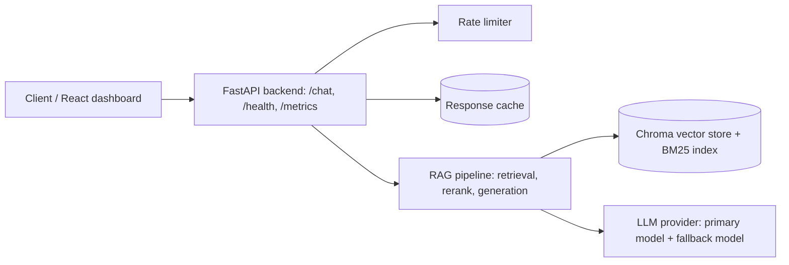
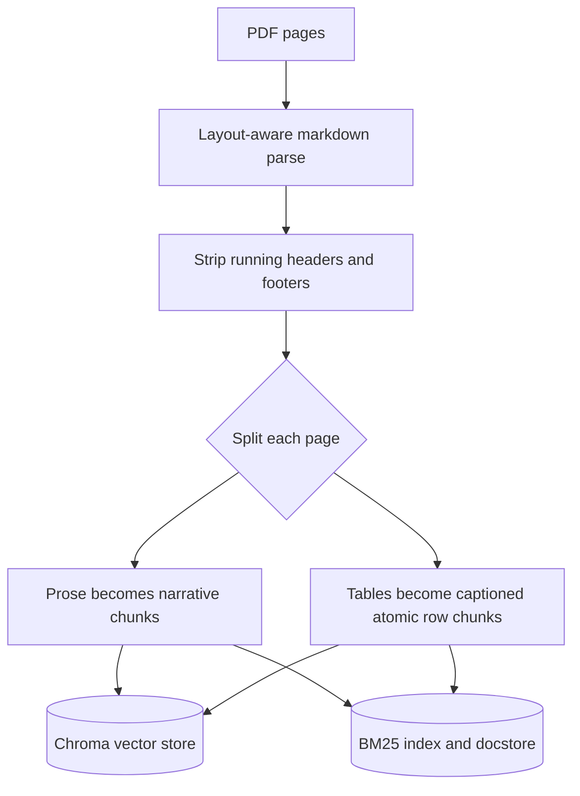
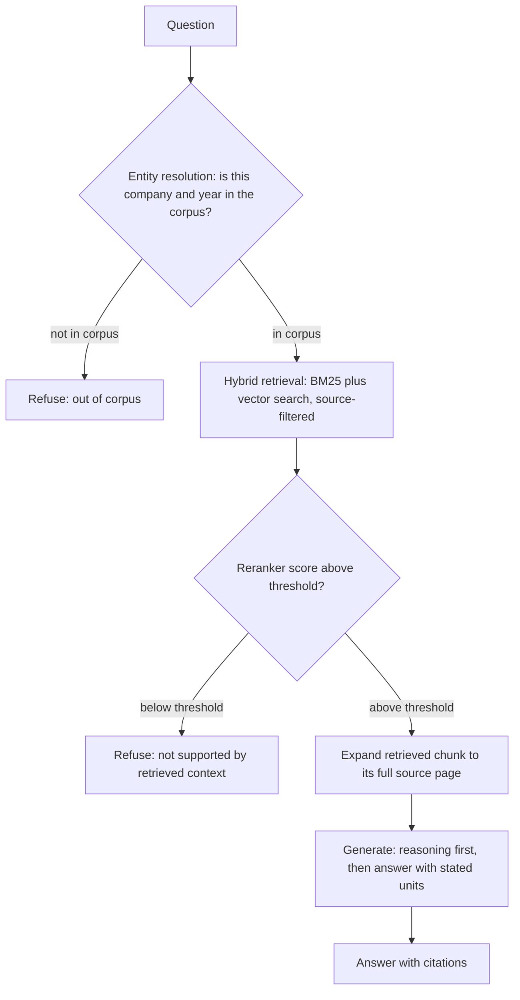
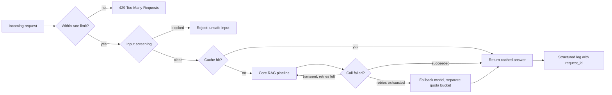
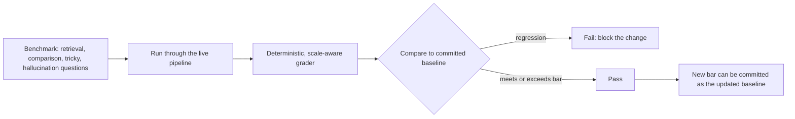

# Financial-Report RAG

A production-grade Retrieval-Augmented Generation API for answering questions
over SEC 10-K filings, built around one governing principle: **the system
must refuse cleanly when it isn't sure, rather than answer confidently and
be wrong.** In a financial context a plausible-sounding wrong number is a
worse outcome than no answer at all, so refusal is treated as a first-class,
mechanically-enforced part of the pipeline rather than something left to the
model's discretion.

## Contents

- [What it does](#what-it-does)
- [Architecture](#architecture)
  - [System overview](#system-overview)
  - [Ingestion — building the index](#ingestion--building-the-index-offline-make-ingest)
  - [Serving — answering a request](#serving--answering-a-request-online-post-chat)
- [Production measures](#production-measures)
- [Evaluation](#evaluation)
- [Scope](#scope)
- [Quickstart](#quickstart)
- [Stack](#stack)
- [Repo layout](#repo-layout)

## What it does

- Answers direct lookups, cross-document comparisons, and computed-metric
  questions over a corpus of financial filings, with citations back to the
  source page.
- Refuses out-of-corpus questions, unsupported questions, and questions
  where retrieval confidence is too low — instead of guessing.
- Parses filings' native mix of prose and tables without shredding tables
  into orphaned numbers.
- Answers always state the unit and scale of a number (e.g. "$688,415
  thousand"), so a figure can't be silently off by a factor of a thousand.
- Runs behind the reliability, security, and observability layer expected of
  a real API, not a notebook: rate limiting, caching, retries with model
  fallback, structured logging, and a regression-gated evaluation suite.

## Architecture

### System overview



### Ingestion — building the index (offline, `make ingest`)



### Serving — answering a request (online, `POST /chat`)



Refusal is decided by two mechanical gates plus one router — a
corpus-inventory check for out-of-scope questions, a reranker relevance
threshold (with a per-source variant for comparison questions) for
under-supported ones. If a question clears both, generation runs on the
full source page (not just the retrieved snippet), with the model required
to reason before answering and to always state a number's unit and scale.

## Production measures



| Concern | Mechanism |
|---|---|
| Rate limiting | Per-client request limits, `429` with `Retry-After` |
| Input safety | Prompt-injection pattern screening; PII masked before logging |
| Latency / cost | Response cache, keyed on the normalized request (mode, retrieval params, question) |
| Reliability | Deterministic 4xx errors skip retry; transient failures retry with backoff, then fail over to a fallback model in a separate provider quota bucket |
| Observability | Structured JSON logs with a `request_id` threaded through every log line and error response; `/health` and `/metrics` endpoints |
| Resource limits | Token budget enforced before each LLM call, so an oversized request fails fast instead of hitting the provider's rate limiter mid-flight |

## Evaluation

Answers are scored against an adversarial benchmark spanning four
categories: direct **retrieval**, cross-document **comparison**, **tricky**
computed/trap questions, and **hallucination** checks (questions with no
true answer in the corpus, testing refusal). Grading is deterministic and
scale-aware: a numeric answer only counts as correct if it matches the
expected value at the unit and scale the answer text itself states — a
number can't be marked right by accident just because some standard
financial scale conversion happens to line up.

| Mode | Overall | Retrieval | Comparison | Tricky | Refusal accuracy |
|---|---|---|---|---|---|
| Vector-only baseline | 60% | 50% | 0% | 50% | 100% |
| **Hybrid (BM25 + vector)** | **90%** | 75% | 100% | 100% | 100% |

The benchmark also serves as a release gate: a committed baseline holds the
accepted quality bar per retrieval mode, and a fresh run fails the gate if
it regresses — refusal accuracy may never drop, and raising the bar is a
reviewed change like any other.



## Scope

- Chroma and a local BM25 index are a deliberate dev-scale choice for a
  small, single-corpus deployment — not a claim about production infra at
  scale. Retrieval sits behind a storage abstraction specifically so a
  larger-scale backend (e.g. Qdrant, pgvector) is a swap, not a rewrite.
- Single-tenant, no auth layer, no persistence beyond the local index — this
  is scoped as a focused RAG service, not a multi-tenant platform.

## Quickstart

```bash
cd backend
uv sync
cp .env.example .env        # add your GROQ_API_KEY
make ingest                 # build the index from data/docs
make run                    # API at http://localhost:8000 (Swagger at /docs)
make eval                   # run the benchmark
make gate                   # check for regressions against the committed baseline
make test                   # pytest
```

```bash
curl -X POST http://localhost:8000/chat \
  -H "Content-Type: application/json" \
  -d '{"message": "What was the net sales of Holley Inc. in fiscal year 2022?"}'
```

Optional dashboard (chat UI with a live pipeline-trace panel, and an eval
results view):

```bash
make ui   # from backend/, with the API already running — Vite dev server on :5173
```

## Stack

**Backend:** Python 3.13, FastAPI, LangChain / LangGraph, Groq-hosted LLMs
(a mid-size model for generation and reranking, with a fallback model in a
separate quota bucket), Chroma + `sentence-transformers` for vector search,
a first-party BM25 retriever fused via an ensemble retriever,
`pymupdf4llm` for layout-aware PDF parsing.
**Frontend:** React + Vite — chat interface with pipeline trace and eval
results views.
**Testing:** pytest, 200+ tests, test-driven throughout.

## Repo layout

```
backend/
  rag/          ingestion (loaders, chunking), retrieval (hybrid, reranker, store),
                generation (prompt, schema), query.py (refusal gates + orchestration)
  app/          FastAPI app, request/response models, rate limiting
  core/         config, caching, logging, reliability (retry/fallback), security, token budget
  eval/         benchmark runner, matcher, regression gate
  tests/        pytest suite
frontend/       React dashboard (chat + pipeline trace + eval results)
docs/           design notes, engineering write-ups
```
